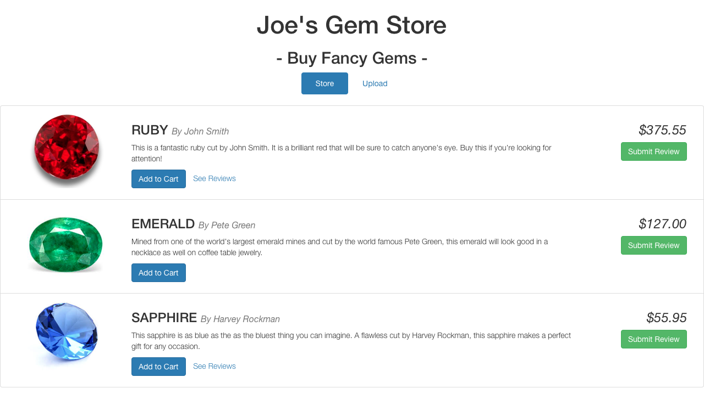
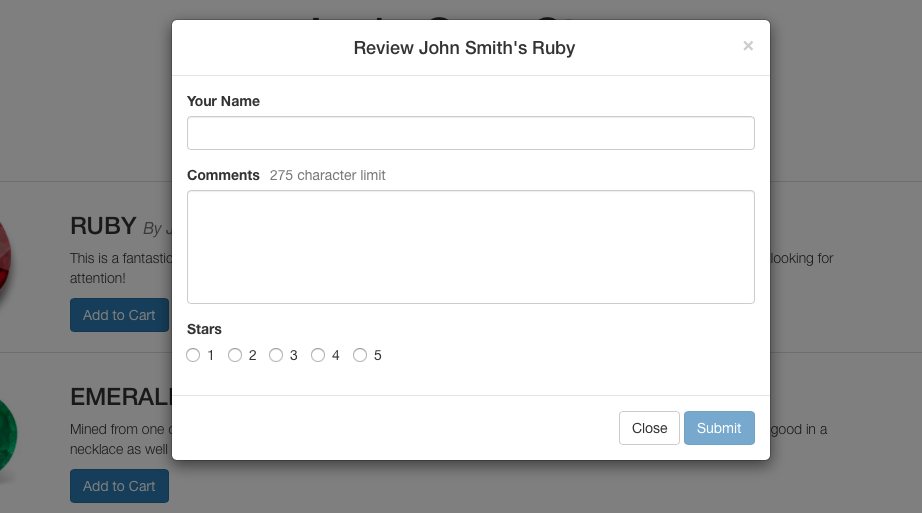
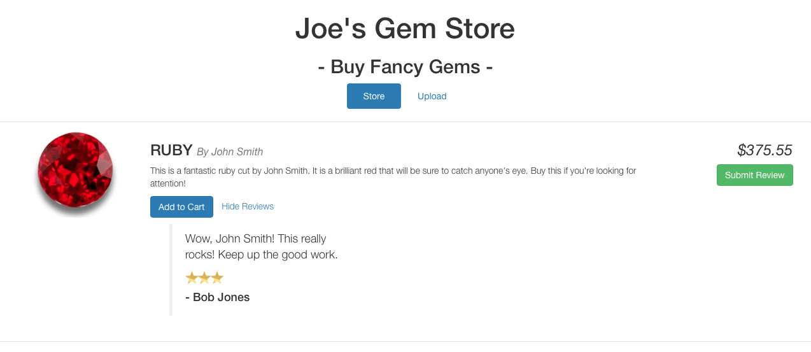

<h1>Angular Store</h1>

I am going through the CodeSchool tutorial on Angular.js and making the application in there while also adding some new stuff on my own.

The application is a fictional "gem store" where you can sell your gems, like rubies and diamonds and stuff.

<h3>Existing Features:</h3>
<ul>
<li>Lists the currently existing gems.</li>
<li>Displays the reviews associated with each gem.</li>
<li>Users can submit their own review for a gem.</li>
</ul>

The application is far from finished and there are still I a lot of things I want to implement.

<h3>Planned Features:</h3>
<ul>
<li>Refactor existing code/html into directives and modules.</li>
<li>Allow uploading of new gems.</li>
<li>Create a user shopping cart.</li>
</ul>

<h2>Screenshots</h2>

The main page

Submitting a review

Listing reviews

